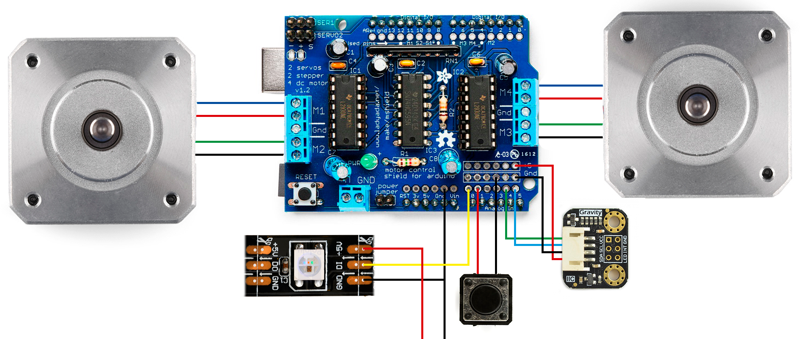
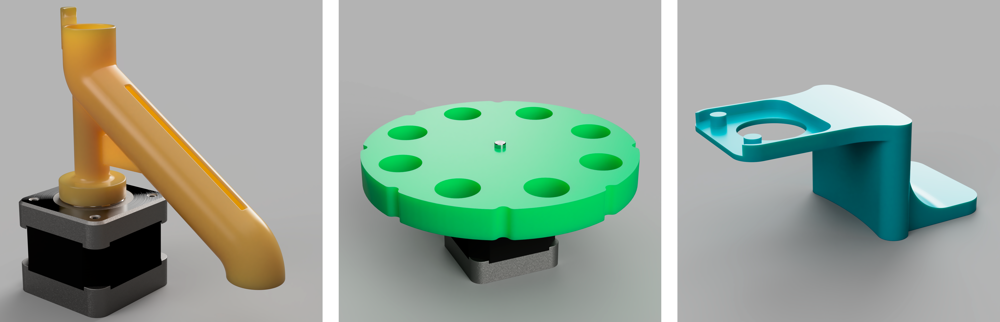
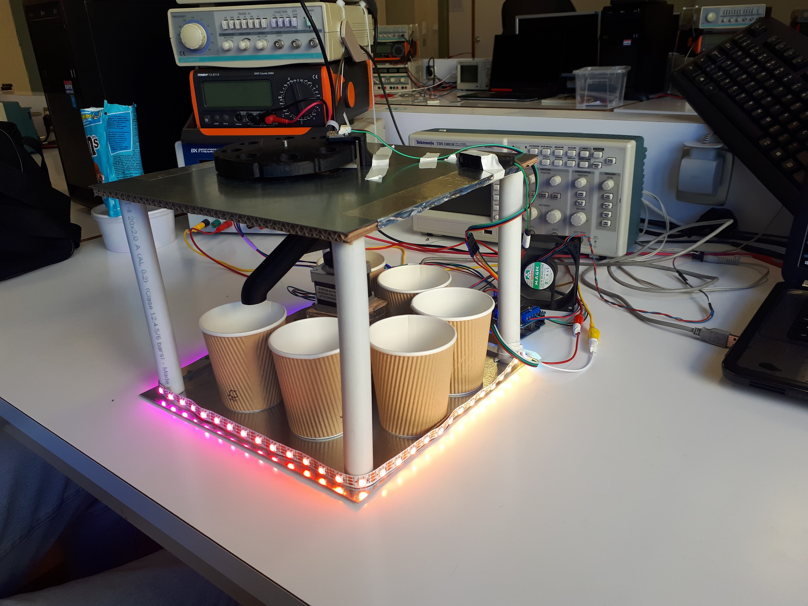
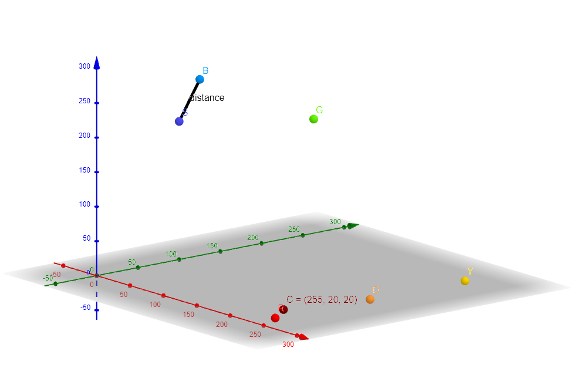

# ArduinoColorSorter
## Introdução
Todo este trabalho tem origem no projeto a desenvolver proposto pelo professor da UC de Introdução à Engenharia Eletrotécnica.
Todos os diferentes projetos sugeridos tinham a sua base na plataforma Arduino com objetivos de trabalho diferentes.

Foi-nos proposto o desenvolvimento de um projeto que tivesse por base o controlo de posição e velocidade síncrono de 2 motores passo Nema17 usando drivers controladores L293D, contidos num módulo shield para um Arduino UNO.

Depois de alguma troca de ideias pensamos em fazer um dispositivo capaz de identificar a cor de um objeto e com base nisso separá-lo junto com outros de uma cor semelhante, ou seja, um separador de objetos por cor, uma vez que seria basicamente necessário adicionar um sensor de cor ao projeto. Decidimos adicionar também um botão para pausar/resumir o programa e uma fita de LEDs para uma fácil visualização da cor do objeto identificada pelo sensor.

Depois de alguma pesquisa percebemos que o uma boa opção seriam M&M’s: fáceis de obter, tendo 6 cores diferentes (vermelho, laranja, amarelo, verde, azul e castanho) e tamanhos semelhantes entre si.

O nosso projeto teve inspiração em alguns trabalhos anteriores que encontramos através de pesquisa na internet. O mais relevante terá sido um projeto completo desenvolvido por Willem Pennings muito bem documentado, com imagens e com projeto também no github:
 - [M&Ms and Skittles sorting machine](https://willempennings.nl/mms-and-skittles-sorting-machine/)
 - [Projeto GitHub](https://github.com/willem-pennings/Candy-sorting-machine)

## Material
  - 1 arduino
  - 1 módulo Adafruit Motor Shield;
  - 2 motores stepper/passo Nema 17;
  - 1 sensor de cor TCS34725 da DFRobot;
  - 1 fita de LEDs digital/endereçável de 1m, com 60LEDs/m;
  - 1 botão
  - x fios de ligação (jumpers)
  
## Hardware
  #### Esquema de Montagem (Schematic)
  
  
  #### Parte Mecânica
  Para facilitar o manuseamento dos M&M’s decidimos imprimir algumas peças em 3D:
  A peça amarela é da autoria de Willem Pennings retirada do projeto mencionado acima e as outras duas foram modeladas por nós no software Fusion 360.
  
  
  
  O motor com a peça amarela acoplada funciona como o próprio seletor do recipiente adequado, a verde é aquela que move os objetos sucessivamente até ao sensor e ao seletor (amarelo). Já a peça azul funciona como um suporte para o sensor de cor para que as leituras sejam mais consistentes à distância ideal.
  
  #### Prototipo Final
  
  
  
  A ideia inicial era de fazer a estrutura redonda em MDF cortado a laser (como no modelo 3D), mas acabamos por fazer um modelo retangular de cartão e chapa galvanizada para lhe conferir resistência (acima).
  
## Software
#### Explicação
Todo o software foi desenvolvido e aperfeiçoado por nós, tendo tido por base algumas bibliotecas:
  - Wire.h (comunicação Arduino - Sensor Cor)
  - DFRobot_TCS34725.h (comunicação Arduino - Sensor Cor)
  - AFMotor.h (controlo dos motores stepper com o shield AdaFruit)
  - FastLED.h (controlo dos LEDs digitais)
Depois de procurar códigos de dispositivos como este online para inspiração decidimos desenvolver um método mais simples que aqueles que encontrámos na determinação da cor de cada objeto. 

Em vez de fazer comparações de cada um dos parâmetros R, G e B da cor lida pelo sensor com valores padrão pensamos no seguinte método:
  1. Construir pontos no espaço cujas coordenadas sejam os valores R,G e B das cores lida e
padrão (Ex: R:255 G:125 B:0 forma o ponto S de coordenadas (255, 125, 0));
  2. Calcular a distância entre o ponto correspondente à cor lida e cada um dos pontos
correspondentes aos valores padrão;
  3. Determinar a distância mínima das anteriores;
  4. Deduzir qual o ponto mais próximo ao lido e, como consequência, determinar a cor mais
próxima.

O processo descrito acima pode ser vizualizado com a ajuda do seguinte gráfico:

Aqui é feita uma abstração dos eixos x, y e z aos valores R, G e B das cores lidas.

#### Código Responsável

Aproximação da cor:
```c
  int aprox_color(){ //devolve o numero da cor mais proxima a que foi lida no sensor
	int color_number = 0;
	float min_distance = distance(0);
  for(int i = 0; i < 7; ++i){
    float cur_distance = distance(i);
    if(cur_distance < min_distance){
      color_number = i;
      min_distance = cur_distance;
    }
  }
  return color_number;
}
```
```c
float distance(int i){ // calcula a distancia da cor lida a cor indicada no argumento
  float dist = sqrt(pow((r-cor[i].r),2) + pow((g-cor[i].g),2) + pow((b-cor[i].b),2));
  return dist;
}
```

Movimento dos motores:
```c
void move2(){
  int movement = abs(next_pos - last_pos);
  movement *= sector_amplitude;
  Serial.print("movimento motor baixo:");
  Serial.println(movement);
  if(next_pos > last_pos) {
    motor2.step(movement, FORWARD, DOUBLE);
    delay(100);
  }
  else {
    motor2.step(movement, BACKWARD, DOUBLE);
    delay(100);
  }
  
  last_pos = next_pos;
}
```

Para informação mais detalhada acerca deste projeto, por favor, consultar os documentos produzidos: [Relatório e Powerpoint](documentos)
